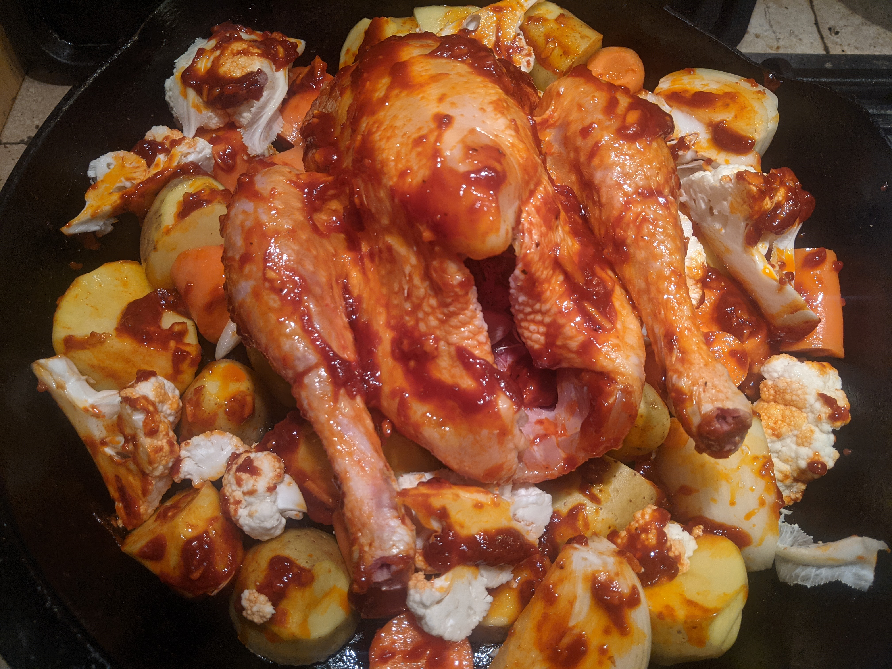

Adapted from https://www.bonappetit.com/recipe/slow-roast-gochujang-chicken.

Modifications: I use half as much garlic, add more veggies, and skip the honey.

If two people work together, the prep can be done in 30 minutes.

#### Step 1

Prehead oven to 300° with rack in the middle.

Season bird with salt and pepper, including inside the cavity.

#### Step 2

Whisk together the gochujang and ¼ cup of olive oil. Grate or mince a couple of garlic cloves, and add that to the gochujang oil. Do the same with the ginger.

#### Step 3

Cut what's left of the head of garlic in half, and put one half of it inside the bird.

#### Step 4

Somehow coat the chicken with roughly half of the gochujang oil. If you have a pastry brush, this is a good time to use it. Reserve some of the gochujang oil to put on the veggies.

#### Step 5

Decide if you want more than just potatoes: adding a couple of carrots and some cauliflower florets is a fine thing. Chop the veggies into medium-sized chunks (you want them small enough that they have plenty of surface area exposed to the sauce).

Arrange the veggies around the outside of your skillet, and plop the chicken down in the middle, right on top of the remaining garlic. You want the garlic to bathe in the rendered chicken fat, and then spread its garlicky goodness to the veggies.

Coat all these veggies with a mixture of the remaining gochujang oil, plus the extra 2 Tbsp of oil. Season with some salt and pepper.

#### Step 6

Slow-roast this until the potatoes are really tender and the chicken skin is a deep reddish-golden brown, 2½-3 hours. You might want to turn the potatoes and other veggies at some point so they are nicely coated in the oily juices that will accumulate in the pan.

When it's done, the legs should be loose, and the chicken should basically fall apart.

Once out of the oven, let everything rest for 10-15 minutes before cutting into the chicken. This will keep the juices in the meat.

#### Step 7

The scallions, limes, and honey are for dressing things up, if you want. We usually skip the honey, and never have enough scallions.
