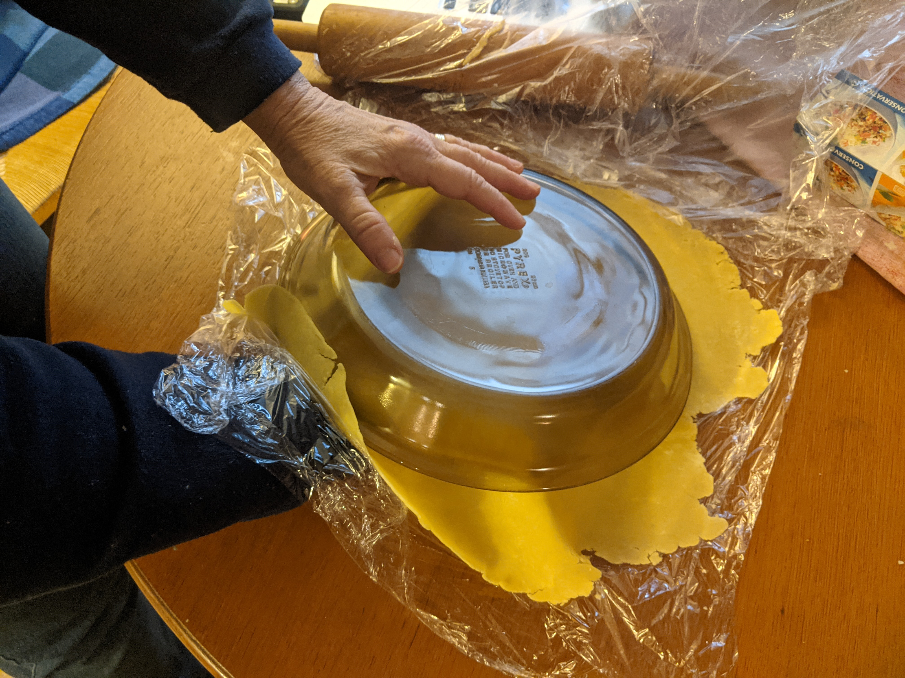
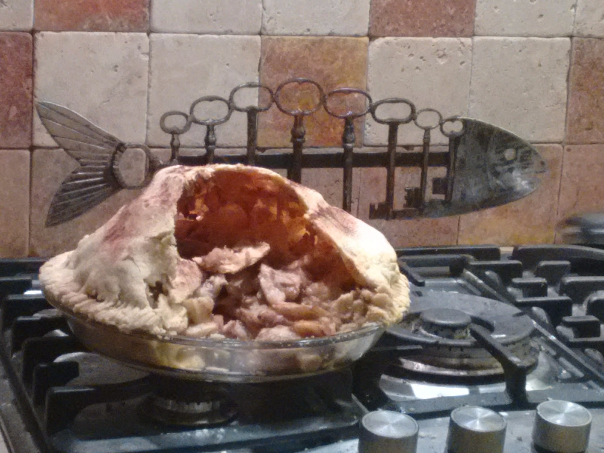

That's it: flour + margarine + salt. The margarine shouldn't have a strong flavor (so avoid brands like Imperial). Also, the lower the milk solids content, the better.

This makes enough pie dough for 2 crusts; i.e., enough for a top and a bottom.

**DO NOT USE BUTTER.**

The margarine should be soft enough to blend in with the flour and salt. It's not necessary to chill the dough, though chilling doesn't hurt and can make rolling out easier, tho I rarely do that because i'm usually in a hurry to get the pie done. 

Divide the dough into two halves, one for each crust. Put each dough ball between two 15-inch lengths of plastic wrap, and roll them out this way.

You can use bottom layer of plastic wrap to help you invert the crust into the pie plate:

For something like a pumpkin pie that only uses a bottom crust, and has a custard filling, conventional wisdom says to pre-bake the crust. Don't bother.

The photo below &mdash; the one that looks like a cave &mdash; is an example of what you get when you bake the pie a bit too long and use either butter, or margarine with too many milk solids: the crust is hard, and the apple filling turns to apple sauce. But it still tastes good.

